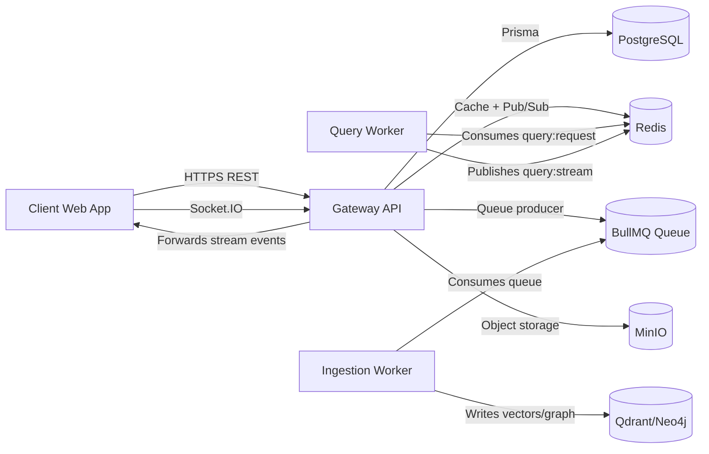
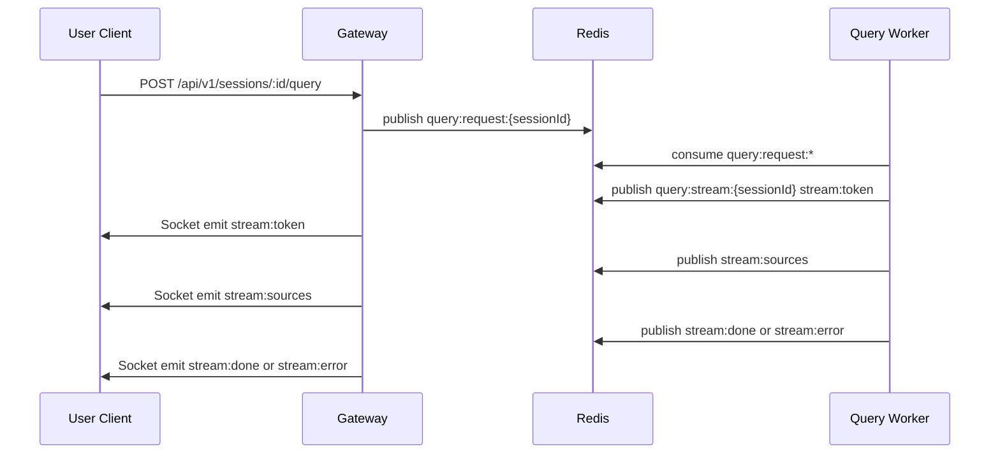
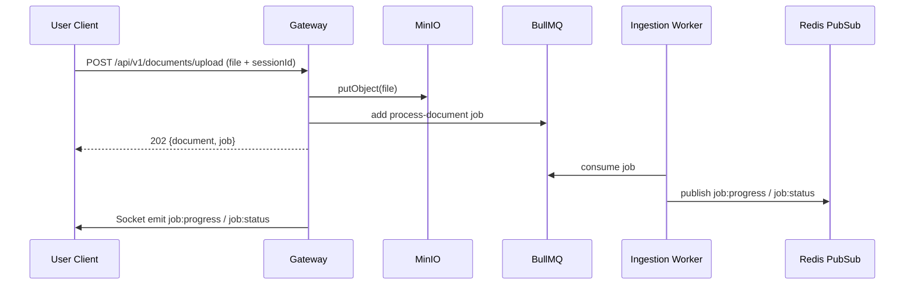

# Gateway API Docs (PolyGot)

This document explains the Gateway service from basic concepts to full endpoint usage.

It is intended for:

- Frontend developers integrating with the API
- Backend developers extending route and service behavior
- QA/DevOps validating request flows and health

## 1. What Is the Gateway?

The Gateway is the HTTP and Socket.IO entrypoint for the platform.

It is responsible for:

- Auth (register, login, profile, logout, password reset)
- Session lifecycle
- Document upload/retrieval/deletion
- Job status access
- Dispatching query requests to Redis for AI workers
- Forwarding AI stream events to client socket rooms

## 2. Tech and Runtime Responsibilities

- Node.js + Express
- Prisma (PostgreSQL)
- Redis (cache, auth session metadata, pub/sub)
- BullMQ (ingestion queue producer)
- MinIO (document object storage)
- Socket.IO (real-time progress and query response streaming)

## 3. Architecture Diagram



## 4. Service Boot and Health

### Base URL

- Local default: `http://localhost:4000`
- API version prefix: `/api/v1`

### Health Endpoints

- `GET /`
- `GET /health`

Examples:

```http
GET / HTTP/1.1
Host: localhost:4000
```

```http
GET /health HTTP/1.1
Host: localhost:4000
```

## 5. Authentication Model

Auth token is set as an `httpOnly` cookie named `token`.

Supported auth input on protected endpoints:

- Cookie token
- `Authorization: Bearer <jwt>`

### Protected Route Middleware

Protected routes use `verifyJWT` and enforce:

- Valid JWT signature
- Token not blacklisted
- User exists

On logout:

- Token `jti` is blacklisted in Redis for remaining TTL
- Session cache key is removed
- Cookie is cleared

## 6. Standard Response and Error Shapes

### Success/Failure Envelope

All responses use the shared envelope:

```json
{
  "statusCode": 200,
  "data": {},
  "message": "Success",
  "success": true
}
```

### Validation/Error Envelope

```json
{
  "statusCode": 400,
  "data": {
    "errors": [
      { "field": "question", "message": "must NOT have fewer than 1 characters" }
    ],
    "timestamp": "2026-04-05T10:00:00.000Z",
    "path": "/api/v1/sessions/abc/query"
  },
  "message": "Validation failed",
  "success": false
}
```

## 7. Rate Limits

Current configured rate limits:

- Auth endpoints: 20 requests / 15 minutes (IP)
- General API protected routes: 100 requests / 15 minutes (IP)
- Upload endpoint: 10 uploads / hour (IP)
- Query endpoint: 20 queries / minute (user ID fallback to IP)

## 8. API Endpoint Map

### Auth

- `POST /api/v1/auth/register`
- `POST /api/v1/auth/login`
- `POST /api/v1/auth/forgot-password`
- `POST /api/v1/auth/reset-password`
- `POST /api/v1/auth/logout` (protected)
- `GET /api/v1/auth/profile` (protected)

### Sessions

- `POST /api/v1/sessions` (protected)
- `GET /api/v1/sessions` (protected)
- `GET /api/v1/sessions/:sessionId` (protected)
- `PATCH /api/v1/sessions/:sessionId` (protected)
- `DELETE /api/v1/sessions/:sessionId` (protected)
- `POST /api/v1/sessions/:sessionId/query` (protected)
- `GET /api/v1/sessions/:sessionId/messages` (protected)

### Documents

- `POST /api/v1/documents/upload` (protected, multipart)
- `GET /api/v1/documents/:documentId` (protected)
- `DELETE /api/v1/documents/:documentId` (protected)

### Jobs

- `GET /api/v1/jobs/:jobId` (protected)

## 9. Detailed Endpoint Docs

## 9.1 Auth Endpoints

### POST /api/v1/auth/register

Body:

```json
{
  "email": "user@example.com",
  "password": "strongpassword",
  "name": "Jane Doe"
}
```

Validation:

- email: valid email
- password: 6..100 chars
- name: optional, 2..100 chars

Response:

- Sets `token` cookie
- Returns user in `data.user`

### POST /api/v1/auth/login

Body:

```json
{
  "email": "user@example.com",
  "password": "strongpassword"
}
```

Response:

- Sets `token` cookie
- Returns user in `data.user`

### GET /api/v1/auth/profile

Protected route.

Returns current user profile from middleware context.

### POST /api/v1/auth/logout

Protected route.

Behavior:

- Blacklists token `jti`
- Clears cookie

### POST /api/v1/auth/forgot-password

Body:

```json
{
  "email": "user@example.com"
}
```

Returns generic success message regardless of account existence.

### POST /api/v1/auth/reset-password

Body:

```json
{
  "email": "user@example.com",
  "token": "64_char_reset_token",
  "password": "newpassword"
}
```

## 9.2 Session Endpoints

### POST /api/v1/sessions

Body:

```json
{
  "title": "Vendor Contract Review"
}
```

Validation:

- title: 1..200 chars

### GET /api/v1/sessions?page=1&limit=20

Query params:

- page: default 1
- limit: default 20, max 100

Response data format:

```json
{
  "data": [
    {
      "id": "...",
      "userId": "...",
      "title": "...",
      "createdAt": "...",
      "updatedAt": "..."
    }
  ],
  "pagination": {
    "page": 1,
    "limit": 20,
    "total": 1,
    "totalPages": 1
  }
}
```

### GET /api/v1/sessions/:sessionId

Returns session plus single associated document (if any), including latest job snapshot.

### PATCH /api/v1/sessions/:sessionId

Body:

```json
{
  "title": "Updated Title"
}
```

### DELETE /api/v1/sessions/:sessionId

Deletes user-owned session.

### GET /api/v1/sessions/:sessionId/messages?limit=50

Returns chat history for the session:

```json
[
  { "role": "USER", "content": "...", "createdAt": "..." },
  { "role": "AI", "content": "...", "createdAt": "..." }
]
```

### POST /api/v1/sessions/:sessionId/query

Body:

```json
{
  "question": "What are the termination obligations?"
}
```

Validation:

- question: 1..8000 chars

Preconditions:

- Session exists and belongs to user
- Session has a document
- Document status is `READY`
- Redis is ready
- Query worker heartbeat key exists

Behavior:

- Publishes payload to Redis channel `query:request:{sessionId}`

Response:

```json
{
  "queued": true,
  "sessionId": "..."
}
```

## 9.3 Document Endpoints

### POST /api/v1/documents/upload

Content type:

- `multipart/form-data`

Form fields:

- `sessionId` (UUID)
- `file` (PDF only, max 50MB)

Behavior:

- Validates session ownership
- Enforces one document per session
- Uploads to MinIO
- Creates `Document` row with `PENDING`
- Creates `Job` row (`FULL_INGESTION`, `QUEUED`)
- Enqueues BullMQ job `process-document`

Response:

```json
{
  "document": { "id": "...", "status": "PENDING", "fileUrl": null },
  "job": { "id": "...", "status": "QUEUED", "taskType": "FULL_INGESTION" }
}
```

### GET /api/v1/documents/:documentId

Returns document with all jobs for that document.

### DELETE /api/v1/documents/:documentId

Behavior:

- Deletes object in MinIO
- Best-effort cleanup in AI stores via MCP:
  - Qdrant tool: `delete_document`
  - Neo4j tool: `delete_document_graph`
- Deletes document from PostgreSQL

## 9.4 Job Endpoint

### GET /api/v1/jobs/:jobId

Returns job with minimal document info.

Authorization rule:

- User must own the linked document

## 10. Realtime Contracts (Socket.IO)

The Gateway subscribes to Redis and forwards events to socket rooms.

Client room joins:

- `join` with `jobId` (for ingestion status/progress)
- `join-session` with `sessionId` (for query stream)

Server events:

- `job:status`
- `job:progress`
- `stream:token`
- `stream:sources`
- `stream:done`
- `stream:error`

### Query Streaming Sequence Diagram



### Upload and Ingestion Sequence Diagram



## 11. Common HTTP Statuses

- 200 OK
- 201 Created
- 202 Accepted
- 400 Validation or business rule failure
- 401 Unauthorized
- 403 Forbidden
- 404 Not found
- 429 Rate limit exceeded
- 503 Dependency unavailable (for example Redis/query worker)

## 12. Example cURL Calls

### Login

```bash
curl -i -X POST http://localhost:4000/api/v1/auth/login \
  -H "Content-Type: application/json" \
  -d '{"email":"user@example.com","password":"strongpassword"}'
```

### Create Session

```bash
curl -i -X POST http://localhost:4000/api/v1/sessions \
  -H "Content-Type: application/json" \
  -H "Authorization: Bearer <token>" \
  -d '{"title":"My Session"}'
```

### Upload Document

```bash
curl -i -X POST http://localhost:4000/api/v1/documents/upload \
  -H "Authorization: Bearer <token>" \
  -F "sessionId=<session-uuid>" \
  -F "file=@contract.pdf;type=application/pdf"
```

### Queue Query

```bash
curl -i -X POST http://localhost:4000/api/v1/sessions/<sessionId>/query \
  -H "Content-Type: application/json" \
  -H "Authorization: Bearer <token>" \
  -d '{"question":"Summarize indemnity obligations"}'
```

## 13. Notes for Contributors

- Keep all responses wrapped in `ApiResponse`.
- Use schema validation (`TypeBox + AJV`) for all new write endpoints.
- Preserve ownership checks at service layer.
- For new async worker flows, define both HTTP kickoff contract and socket event contract in docs.
