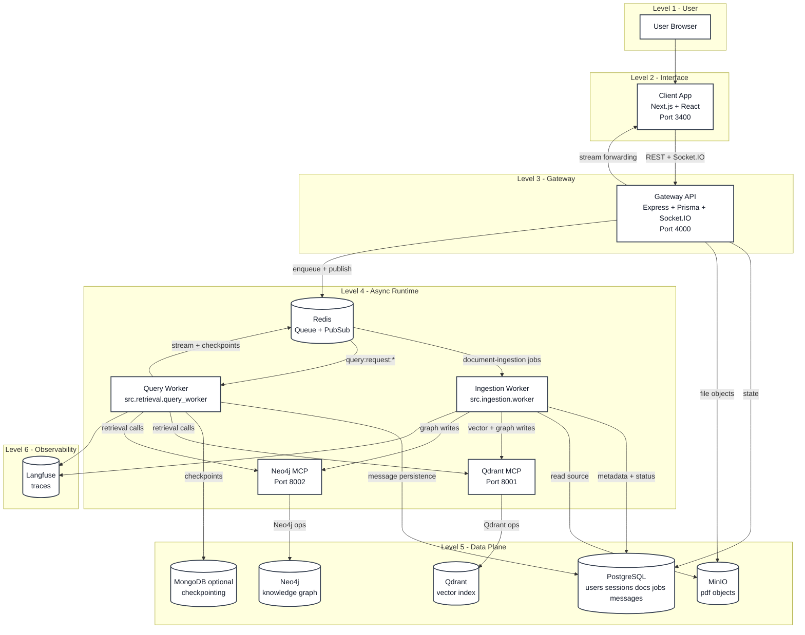
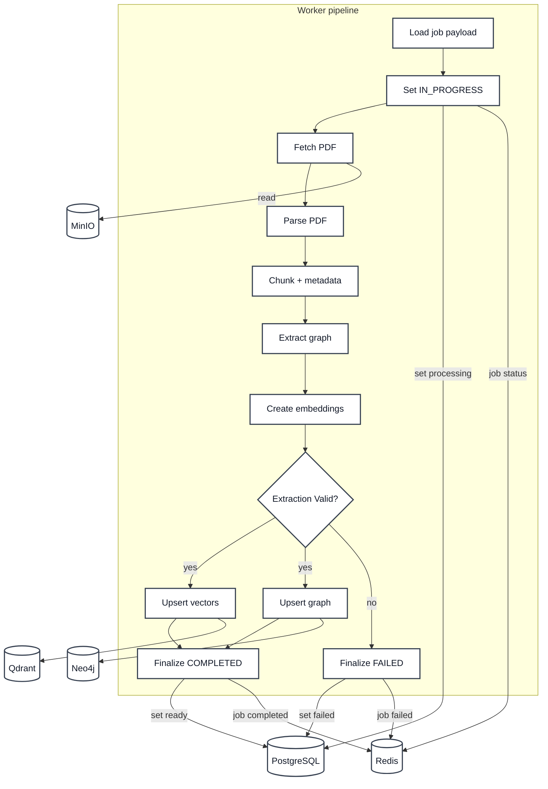
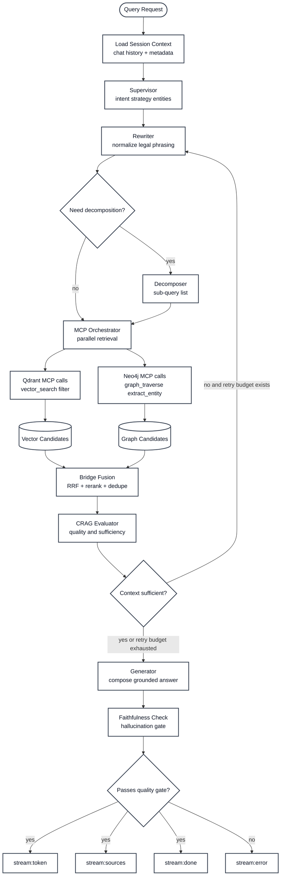
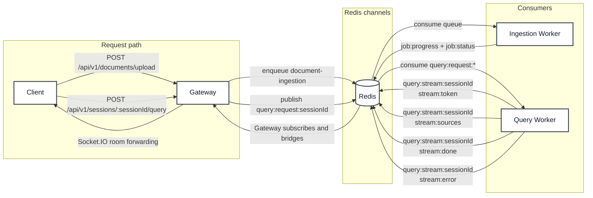
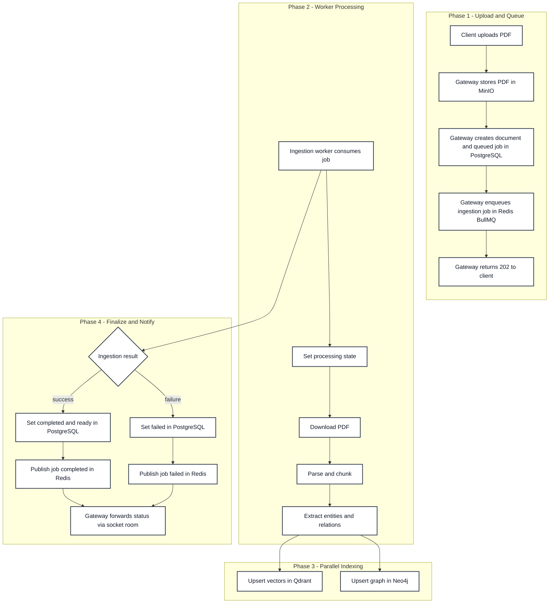
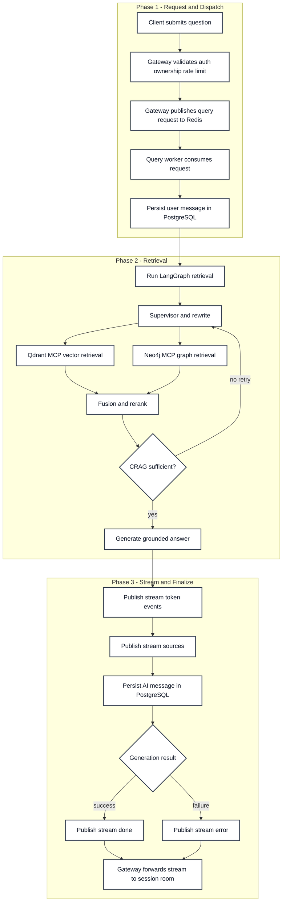

# PolyGot

PolyGot is an end-to-end legal document intelligence platform.

It supports:

- Secure auth and session management
- PDF upload and ingestion pipeline
- Hybrid retrieval (vector + graph)
- Streaming, citation-aware AI answers
- Real-time progress and query updates

This README is the single project-level guide for understanding architecture, data flow, and local setup.

## 1. Monorepo Layout

- `client`: Next.js frontend app
- `Gateway`: Express + Prisma API and Socket.IO bridge
- `ai-service`: Python ingestion/retrieval workers and MCP servers
- `docker-compose.yml`: local infrastructure stack

## 2. System Design (Deep View)

This section gives in-depth diagrams for architecture and communication.

### 2.1 Container-Level Architecture



### 2.2 Ingestion Pipeline (Internal Components)



### 2.3 Retrieval + Generation Pipeline (LangGraph)



### 2.4 Communication Contracts and Channels



## 3. Ingestion Workflow (Execution Timeline)

Ingestion starts when a user uploads a PDF in the client.



## 4. Query Retrieval and Streaming Workflow (Execution Timeline)

Retrieval starts when the user asks a question in a READY session.



## 5. LangGraph Retrieval Design

The query worker uses a LangGraph state machine in `ai-service/src/retrieval/graph.py`.

Core nodes:

- Supervisor: classify intent, strategy, entities
- Rewriter: normalize query for recall and grounding
- Decomposer: split complex legal asks into atomic sub-queries
- MCP Orchestrator: parallel Qdrant and Neo4j retrieval calls
- Bridge Fusion: combine graph-linked chunks + vector hits with RRF
- CRAG Evaluator: decide sufficient/partial/insufficient context
- Generator: stream answer, attach sources, run hallucination checker

High-level route logic:

- `supervisor -> rewriter`
- `rewriter -> decomposer` for multi-part questions, otherwise direct retrieval
- `... -> mcp_orchestrator -> bridge_fusion -> crag_evaluator`
- CRAG can retry rewrite on insufficient evidence
- Final response generated only after context gate

## 6. Tech Stack by Layer

Client:

- Next.js 16, React 19, TypeScript
- Zustand state management
- Axios + cookie auth
- Socket.IO client for live events

Gateway:

- Express 5, TypeScript
- Prisma + PostgreSQL
- Redis + BullMQ queue producer
- MinIO document storage
- Socket.IO Redis-stream bridge
- TypeBox + AJV validation

AI service:

- FastAPI MCP servers
- BullMQ Python worker consumers
- LangGraph orchestration
- LangChain + OpenAI models
- LlamaParse for PDF parsing
- Qdrant dense+sparse hybrid retrieval
- Neo4j graph extraction/traversal
- Langfuse observability
- MongoDB optional checkpoint backend

Infrastructure:

- PostgreSQL
- Redis
- MinIO
- Qdrant
- Neo4j
- MongoDB
- Langfuse
- Ollama (optional)

## 7. Performance and Reliability Boosts

Implemented optimization patterns include:

- Parallel retrieval calls (Qdrant + Neo4j) through MCP orchestrator
- Reciprocal Rank Fusion plus rerank for quality boost
- Singleton/shared clients for Redis, DB, and MCP HTTP transport
- Worker heartbeat checks before query dispatch
- Retry and timeout logic around external model/tool calls
- Cache-assisted session/document reads in Gateway
- Graceful shutdown and cancellation handling in workers
- Best-effort stale-data cleanup in Qdrant and Neo4j on document delete

## 8. API and Event Contracts

Gateway API docs:

- `Gateway/Api docs.md`

Client docs:

- `client/README.md`

AI service docs:

- `ai-service/README.md`

Key query stream events:

- `stream:token`
- `stream:sources`
- `stream:done`
- `stream:error`

Key job events:

- `job:progress`
- `job:status`

## 9. Local Setup (Full Stack)

### 9.1 Start infrastructure

From repository root:

```powershell
docker compose up -d
```

### 9.2 Start Gateway

```powershell
cd Gateway
npm install
npm run dev
```

### 9.3 Start Client

```powershell
cd client
npm install
npm run dev
```

### 9.4 Start AI Service processes

In separate terminals:

```powershell
cd ai-service
python -m src.mcp_servers.qdrant_mcp_server
```

```powershell
cd ai-service
python -m src.mcp_servers.neo4j_mcp_server
```

```powershell
cd ai-service
python -m src.ingestion.worker
```

```powershell
cd ai-service
python -m src.retrieval.query_worker
```

## 10. Typical User Journey

1. User logs in.
2. User creates a session.
3. User uploads one PDF to the session.
4. Client receives ingestion progress updates in real time.
5. Once status is READY, user asks a question.
6. Client receives streamed answer tokens and final cited response.

## 11. Security and Controls

- JWT auth with httpOnly cookie handling
- Protected API routes with ownership checks
- Query endpoint per-user rate limiting (20 queries/min)
- Upload endpoint type and size validation (PDF, max 50MB)
- MCP server API-key gate for tool calls

## 12. Contribution Notes

When making changes:

- Keep contracts backward compatible between client, gateway, and ai-service
- Update component-level docs in each service README
- Update `Gateway/Api docs.md` for any endpoint/event changes
- Include migration notes when changing DB schema or message/event shape

## 13. License and Internal Use

Add your project license policy here (MIT/Apache-2.0/Internal).
