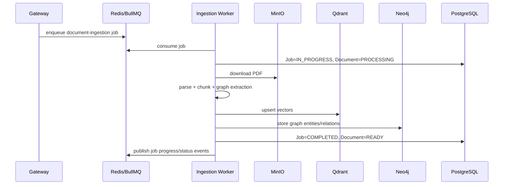
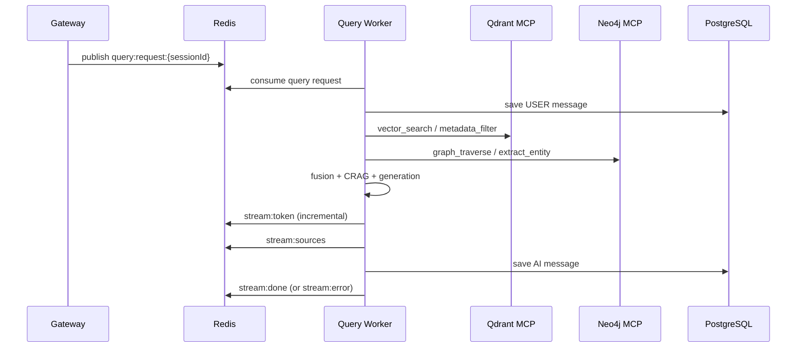

# AI Service (PolyGot)

This service handles the AI-heavy backend for PolyGot:

- Document ingestion (parse, chunk, embed, graph extraction, indexing)
- Query-time retrieval and answer generation (streaming)
- MCP tool servers for Qdrant and Neo4j access
- Progress + stream event publishing via Redis

If you are new to the project, start with this README and you can run the full AI path end-to-end.

---

## 1) What This Service Does

At a high level:

1. Gateway uploads a PDF and enqueues ingestion job data in Redis/BullMQ.
2. Ingestion worker picks the job, parses and indexes the document in vector + graph stores.
3. User asks question in UI.
4. Gateway publishes query request in Redis.
5. Query worker runs retrieval graph and streams answer tokens back through Redis.
6. Gateway forwards stream events to the client over Socket.IO.

---

## 2) Architecture Diagram

```mermaid
flowchart LR
    G[Gateway API] -->|BullMQ job data| R[(Redis)]
    R -->|document-ingestion queue| IW[Ingestion Worker]

    IW -->|download PDF| M[(MinIO)]
    IW -->|save vectors| QD[(Qdrant)]
    IW -->|save entities/relations| N4[(Neo4j)]
    IW -->|update job/doc status| PG[(PostgreSQL)]
    IW -->|job progress events| R

    G -->|query:request:{sessionId}| R
    R -->|query requests| QW[Query Worker]

    QW -->|MCP tool calls| QMCP[Qdrant MCP Server :8001]
    QW -->|MCP tool calls| NMCP[Neo4j MCP Server :8002]
    QMCP --> QD
    NMCP --> N4

    QW -->|persist chat messages| PG
    QW -->|stream:token/sources/done/error| R
```

---

## 3) Main Components

### 3.1 Ingestion Pipeline

Key files:

- `src/ingestion/worker.py`
- `src/ingestion/pipeline.py`
- `src/ingestion/chunker.py`
- `src/ingestion/graph_extractor.py`
- `src/ingestion/vector_indexer.py`

Responsibilities:

- Pull queued ingestion jobs from Redis/BullMQ
- Parse PDF using LlamaParse
- Chunk legal text with metadata
- Generate dense + sparse embeddings
- Write to Qdrant collection
- Extract legal graph docs and store in Neo4j
- Update PostgreSQL `Job` and `Document` status
- Publish progress events (`job:progress`, `job:status`) to Redis

### 3.2 Retrieval Query Pipeline

Key files:

- `src/retrieval/query_worker.py`
- `src/retrieval/graph.py`
- `src/retrieval/routes.py`
- `src/retrieval/state.py`
- `src/retrieval/nodes/*`

Responsibilities:

- Consume query requests from Redis channel pattern `query:request:*`
- Build LangGraph retrieval state machine
- Run supervisor -> rewrite/decompose -> retrieval orchestration -> fusion -> CRAG -> generation
- Persist chat messages to PostgreSQL
- Publish streaming events to Redis channel `query:stream:{sessionId}`

Node roles (`src/retrieval/nodes`):

- `supervisor.py`: intent + strategy selection
- `rewriter.py`: retrieval-focused query normalization
- `decomposer.py`: query decomposition for complex asks
- `mcp_orchestrator.py`: parallel MCP calls to Qdrant/Neo4j
- `bridge_fusion.py`: bridge + RRF fusion + rerank
- `crag_evaluator.py`: retrieval sufficiency check
- `generator.py`: streamed answer generation + faithfulness check + sources

### 3.3 MCP Servers

Key files:

- `src/mcp_servers/qdrant_mcp_server.py`
- `src/mcp_servers/neo4j_mcp_server.py`

Responsibilities:

- Expose tool endpoints (`POST /messages`) for retrieval worker
- Wrap direct Qdrant and Neo4j operations with uniform tool contracts
- Optional auth via `X-API-Key`

Default ports:

- Qdrant MCP: `8001`
- Neo4j MCP: `8002`

### 3.4 Shared Infrastructure Layer

Key files:

- `src/shared/settings.py`
- `src/shared/database_service.py`
- `src/shared/redis_client.py`
- `src/shared/neo4j_service.py`
- `src/shared/langfuse_config.py`
- `src/shared/progress_events.py`

Responsibilities:

- Settings/env loading
- Shared DB/Redis clients
- Neo4j helpers and indexes
- Langfuse trace/observation helpers
- Progress event publishing

---

## 4) End-to-End Flows

### 4.1 Ingestion Flow



### 4.2 Query Streaming Flow



---

## 5) Directory Map

```text
ai-service/
  src/
    ingestion/          # document processing pipeline
    retrieval/          # query-time retrieval graph + workers
      nodes/            # LangGraph node implementations
      utils/            # parsing/stream/json helpers
    mcp_servers/        # Qdrant + Neo4j tool servers
    shared/             # settings, db, redis, tracing, services
```

---

## 6) Environment Setup

1. Copy env template:

```powershell
copy .env.example .env
```

2. Fill required keys in `.env`.

Minimum required for local run:

- `LLAMA_CLOUD_API_KEY`
- `REDIS_HOST`, `REDIS_PORT`, `REDIS_PASSWORD`
- `DATABASE_URL`
- `MINIO_ENDPOINT`, `MINIO_ACCESS_KEY`, `MINIO_SECRET_KEY`, `MINIO_BUCKET`
- `QDRANT_URL`
- `NEO4J_URI`, `NEO4J_USER`, `NEO4J_PASSWORD`
- `MCP_AUTH_KEY` (recommended)
- `OPENAI_API_KEY` (required for retrieval/generation)

Optional but useful:

- Langfuse keys (`LANGFUSE_PUBLIC_KEY`, `LANGFUSE_SECRET_KEY`)
- MongoDB checkpoint settings
- `MEM0_API_KEY`

Important defaults:

- Qdrant MCP URL default: `http://localhost:8001`
- Neo4j MCP URL default: `http://localhost:8002`
- Qdrant collection default: `legal_contracts_hybrid`

---

## 7) Install and Run

From `ai-service` directory:

### 7.1 Create venv and install

```powershell
python -m venv venv
.\venv\Scripts\Activate.ps1
pip install -r requirements.txt
```

### 7.2 Run workers and MCP servers (separate terminals)

Terminal 1 (Qdrant MCP):

```powershell
python -m src.mcp_servers.qdrant_mcp_server
```

Terminal 2 (Neo4j MCP):

```powershell
python -m src.mcp_servers.neo4j_mcp_server
```

Terminal 3 (Ingestion Worker):

```powershell
python -m src.ingestion.worker
```

Terminal 4 (Query Worker):

```powershell
python -m src.retrieval.query_worker
```

---

## 8) Redis/Event Contracts

### 8.1 Ingestion Events

Published by ingestion worker:

- `job:{jobId}` with status payload
- progress events with `job:progress`

Typical statuses:

- `QUEUED`
- `IN_PROGRESS`
- `COMPLETED`
- `FAILED`

### 8.2 Query Events

Input channel:

- `query:request:{sessionId}`

Output channel:

- `query:stream:{sessionId}`

Output event types:

- `stream:token`
- `stream:sources`
- `stream:done`
- `stream:error`

---

## 9) Data Stores and What Goes Where

- PostgreSQL
  - `Job`, `Document`, `Message`, session-linked metadata
- MinIO
  - Raw uploaded PDFs
- Qdrant
  - Dense/sparse chunk vectors + metadata
- Neo4j
  - Document entities and relationships
- Redis
  - Queue transport, worker heartbeats, stream events

---

## 10) Observability

Langfuse integration is implemented in:

- `src/shared/langfuse_config.py`

Used by:

- Ingestion worker via `trace_ingestion`
- Query worker via `trace_query`

If Langfuse keys are missing, service still runs with no-op tracing.

---

## 11) Troubleshooting

### Worker starts but Gateway says query service unavailable

Check:

- Query worker is running
- Heartbeat key exists in Redis (`query-worker:heartbeat`)
- Redis credentials match `.env`

### MCP call failures

Check:

- Both MCP servers are running on expected ports
- `MCP_AUTH_KEY` matches between caller and server
- Qdrant/Neo4j connectivity is healthy

### Ingestion stuck in PROCESSING

Check:

- Ingestion worker logs for parse/index errors
- LlamaParse key validity
- MinIO object exists and is readable

### No stream tokens in UI

Check:

- Query worker logs
- Redis `query:stream:*` events
- Gateway socket forward path

---

## 12) Development Notes

- Query worker implementation is intentionally inside retrieval package:
  - `src/retrieval/query_worker.py`
- MCP `/sse` endpoints are currently stubs; tool calls are handled over `POST /messages`.

---

## 13) GitHub Push Guide

If this repository is already connected to GitHub:

```powershell
git status
git add ai-service/README.md
git commit -m "docs(ai-service): add complete architecture and run guide"
git push origin <your-branch>
```

If you need a new branch first:

```powershell
git checkout -b docs/ai-service-readme
git add ai-service/README.md
git commit -m "docs(ai-service): add complete architecture and run guide"
git push -u origin docs/ai-service-readme
```

If this project is not connected to a remote yet:

```powershell
git init
git add .
git commit -m "Initial commit"
git branch -M main
git remote add origin <your-github-repo-url>
git push -u origin main
```

---

## 14) Recommended Next Docs (Optional)

- Add endpoint-level docs for MCP tools with request/response examples
- Add architecture image export from Mermaid diagrams for non-Mermaid viewers
- Add local smoke-test checklist for ingestion and query flows
